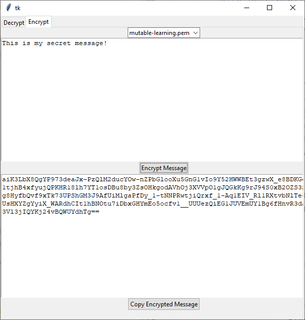

# Build it Together Episode 2 - Encrypt and Decrypt your messages using Public/Private keys!

[Back to Episode List](../../README.md)

[Watch this episode on YouTube](https://youtu.be/z5kuPIweMI8)

[Get the code for this episode here](EncryptMessages.py)

This is a longer project that uses a variety of tkinter widgets including: notebook, combobox, buttons and text boxes to create a simple interface for working with asymmetric encryption.

It uses the [Cryptography Library](https://github.com/pyca/cryptography) to create and work with RSA public and private keys.

Build this application and test it out with your friends and family by sending and receiving encrypted messages. 

