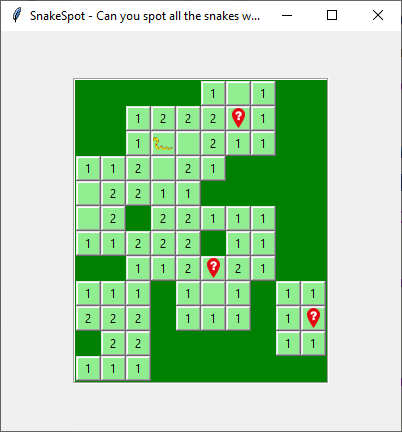

# Build it Together Episode 3 - A venomous minesweeper game from the outback!

[Back to Episode List](../../README.md)

[Watch this episode on YouTube](https://youtu.be/a3igAmKrd30)

[Get the code for this episode here](SnakeSpot.py)

This project will help you to develop your own minesweeper game using Tkinter and Python. It is surprising how little code you will need to get it working! For a change, we add a twist by spotting snakes in the grass instead of mines.

This game relies on **sets** in python. These allow you to quickly compare groups of data, and can be a really handy tool in your toolbox if you learn how to use them.

Build this application and test it out with your friends and family and see if they can find all the snakes hiding in the grass without getting bitten. 

